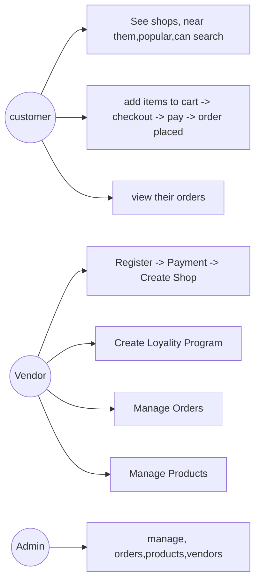
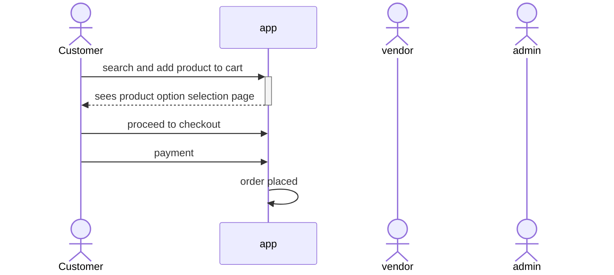

# Use Case Diagram

```mermaid
flowchart LR

c((customer)) 
v((Vendor))
a((Admin))

%%usecases

%% vendor usecases
1[Register -> Payment -> Create Shop]
2[Create Loyality Program]
3[Manage Orders]
4[Manage Products]


%% customer usecases
5[See shops, near them,popular,can search]
6[add items to cart -> checkout -> pay -> order placed]
7[view their orders]
8[manage, orders,products,vendors ]

v-->1
v-->2
v-->3
v-->4

a-->8

c-->5
c-->6
c-->7

```

# Sequence Diagram

```mermaid
sequenceDiagram

    actor c as Customer
    participant b as app
    actor v as vendor
    actor a as admin

    c->>+b:search and add product to cart
    b-->>-c: sees product option selection page

    c->>b:proceed to checkout
    c->>b:payment
    b->>b:order placed

    


```